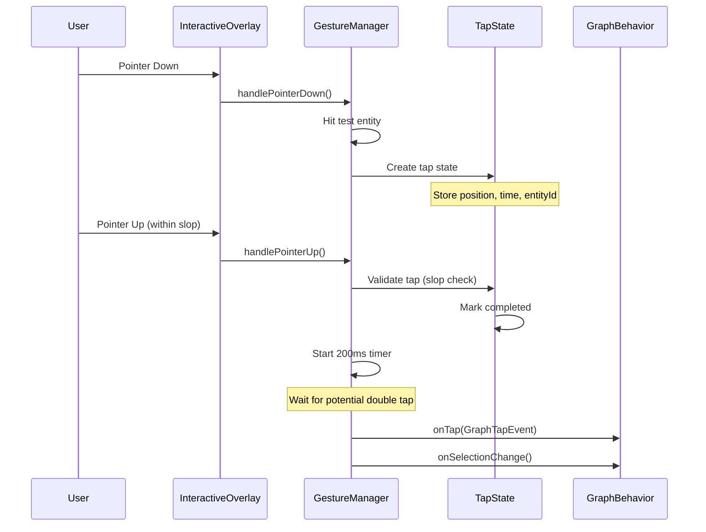
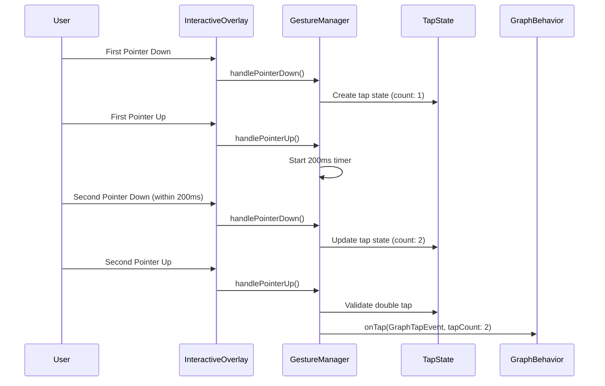
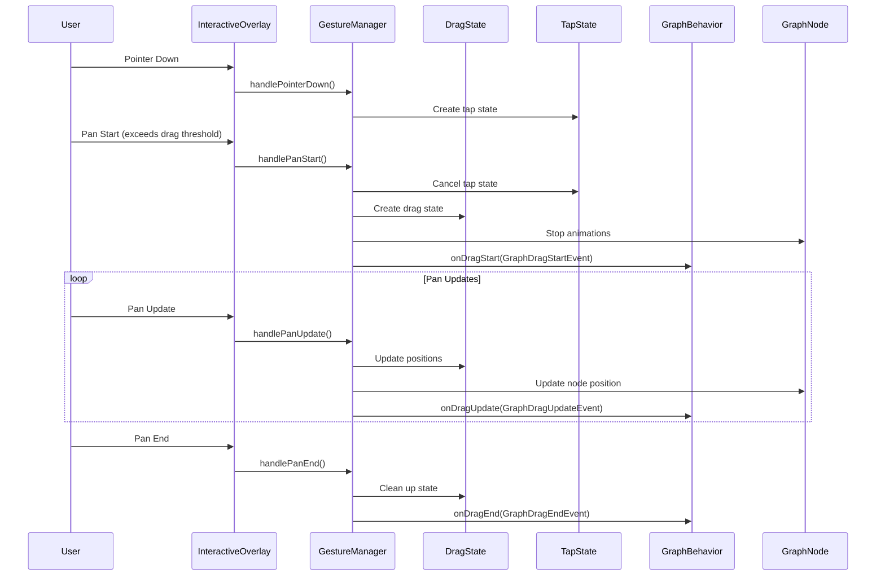
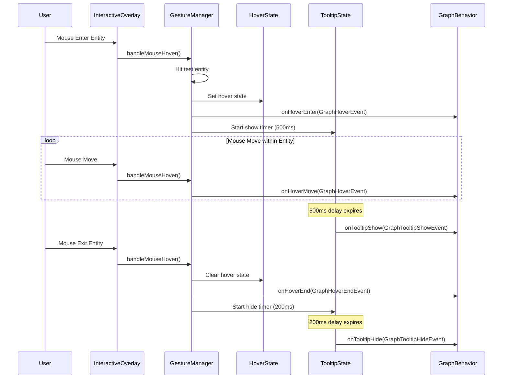
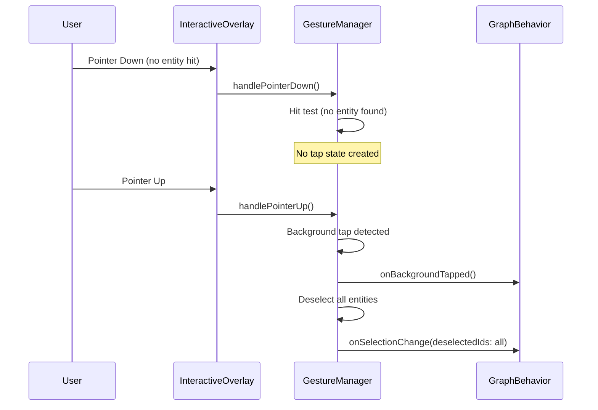

# CLAUDE.md

This file provides guidance to Claude Code (claude.ai/code) when working with code in this repository.

## Project Overview

Plough is a Flutter package for creating interactive network graph visualizations with multiple layout algorithms and customizable appearance. The package uses Flutter's standard state management (ValueNotifier, InheritedWidget) and follows clean architecture principles.

## Common Development Commands

### Package Development
```bash
# Get dependencies
flutter pub get

# Run code generation for Freezed models
dart run build_runner build --delete-conflicting-outputs

# Analyze code
flutter analyze

# Run tests
flutter test

# Run specific test file
flutter test test/plough_test.dart
```

### Example App Development (in example/ directory)
```bash
cd example

# Run on macOS
flutter run -d macos

# Run on iOS Simulator
flutter run -d ios

# Run on web
flutter run -d chrome

# Build for release
flutter build macos
flutter build ios
flutter build web
```

## Architecture Overview

### Core Components Structure

1. **Data Model Layer** (`lib/src/graph/`)
   - `Graph`: Central data structure using ValueNotifier for reactive state
   - `GraphNode` & `GraphLink`: Core entities with factory pattern
   - `GraphEntity`: Base interface for nodes and links
   - `GraphId`: Type-safe identifiers using Freezed
   - All implementations use internal classes (suffixed with `Impl`) for encapsulation

2. **Layout System** (`lib/src/layout_strategy/`)
   - `GraphLayoutStrategy`: Base class using Strategy pattern
   - Concrete strategies: ForceDirected, Tree, Manual, Random, Custom
   - Each strategy calculates node positions based on graph structure
   - Support for fixed node positions and padding

3. **Rendering Layer** (`lib/src/graph_view/` & `lib/src/renderer/`)
   - `GraphView`: Main widget orchestrating the visualization
   - `GraphNodeView` & `GraphLinkView`: Individual entity widgets
   - Behavior system for customizing appearance and interaction
   - Default renderers with support for custom shapes

4. **Interaction System** (`lib/src/interactive/`)
   - `GraphGestureManager`: Central coordinator for all gestures
   - Specialized state managers for tap, drag, hover, and tooltips
   - Event-driven architecture with type-safe events
   - Support for selection, dragging, and custom behaviors

### Key Design Patterns

- **Reactive State**: Uses Flutter standard ValueNotifier and InheritedWidget for efficient reactivity
- **Factory Pattern**: For creating nodes and links
- **Strategy Pattern**: For layout algorithms
- **Composition**: Behavior system allows mixing features
- **Immutability**: Freezed for data classes

### State Management Flow

1. Graph data changes → ValueNotifier notifications
2. GraphView listens via InheritedWidget → Triggers rebuild
3. Layout strategy calculates positions
4. Widgets render with animations
5. User interactions → Event emission → State updates → UI updates

### State Management Implementation Details

The package uses Flutter's standard state management without external dependencies:

- **GraphInheritedData**: Core InheritedWidget that distributes graph data, build state, and behaviors throughout the widget tree
- **ValueNotifier**: Used for reactive properties like node positions, selection state, and animation states
- **AnimatedBuilder**: Efficiently rebuilds only when relevant data changes
- **Batch Updates**: Layout changes are batched to maintain 60FPS performance during animations
- **Separation of Concerns**: Layout changes and selection changes use separate listeners to minimize rebuilds

Key files:
- `lib/src/graph_view/inherited_data.dart`: InheritedWidget implementation
- `lib/src/graph/graph_base.dart`: Core graph state with ValueNotifier
- `lib/src/graph/node.dart` & `lib/src/graph/link.dart`: Entity-level state management

## Code Generation

The project uses Freezed for immutable data classes. Files requiring code generation:
- `graph_data.dart` → `graph_data.freezed.dart`
- `id.dart` → `id.freezed.dart`, `id.g.dart`
- `data.dart` (graph_view) → `data.freezed.dart`
- `geometry.dart` → `geometry.freezed.dart`
- `link.dart` (renderer/style) → `link.freezed.dart`
- `node.dart` (renderer/style) → `node.freezed.dart`

Run code generation after modifying these files:
```bash
dart run build_runner build --delete-conflicting-outputs
```

## Testing Approach

Tests are located in `test/`. The package uses standard Flutter testing:
- Unit tests for data models and layout algorithms
- Widget tests for UI components
- Integration tests for graph interactions

## Development Guidelines

1. **Linting**: Project uses `very_good_analysis` package
   - Some rules are disabled in `analysis_options.yaml`
   - Run `flutter analyze` before commits

2. **API Design**: 
   - Public APIs use factory constructors
   - Internal implementations are private
   - Extensive use of named parameters for clarity

3. **Performance**:
   - ValueNotifier and InheritedWidget provide efficient updates
   - Layout calculations are optimized for 60FPS with batch updates
   - Animations use Flutter's animation system
   - Designed to handle hundreds to thousands of entities efficiently

4. **Extension Points**:
   - Custom layout strategies via `GraphCustomLayoutStrategy`
   - Custom behaviors via `GraphViewBehavior`
   - Custom shapes and renderers

## Working with the Example App

The `example/` directory contains a full demonstration app showcasing:
- Different layout strategies
- Custom node/link rendering
- Interactive features
- Sample data generation

When testing changes, use the example app to verify functionality across different scenarios.

## Interaction System Implementation Details

This section provides detailed technical documentation for the interaction system in `lib/src/interactive/`.

### Architecture Overview

The interaction system implements a sophisticated event-driven architecture with:
- **GraphGestureManager**: Central coordinator orchestrating all gesture handling
- **Specialized State Managers**: Individual managers for tap, drag, hover, and tooltip
- **Event System**: Type-safe events for communicating gesture results
- **Debug System**: Comprehensive debugging and telemetry capabilities

### Low-Level Gesture API Usage

The interaction system deliberately uses low-level Flutter gesture APIs (`MouseRegion`, `Listener`, `RawGestureDetector`) instead of the high-level `GestureDetector` widget.

**Why Low-Level APIs?**
- **Performance**: `GestureDetector` introduces noticeable latency due to its gesture disambiguation logic
- **Direct Control**: Low-level APIs provide immediate access to pointer events without delays
- **Precise Timing**: Critical for responsive graph interactions where milliseconds matter
- **Custom Hit Testing**: Enables per-gesture hit test customization

**API Stack**:
```dart
MouseRegion      // Mouse hover events
    ↓
Listener         // Raw pointer events (down/up/move)
    ↓
RawGestureDetector  // Custom gesture recognizers
```

This architecture ensures the most responsive possible interaction experience.

### Gesture Detection Algorithms

#### Tap Detection (`tap_state.dart`)

**Algorithm and Thresholds**:
- **Touch Slop**: `kTouchSlop * 8` (64 pixels on most devices) for highly forgiving tap recognition
- **Double Tap**: 500ms timeout between taps, uses `kDoubleTapSlop` for position tolerance
- **State Tracking**: Tracks entityId, positions, timestamps, and completion status

**Detection Flow**:
1. Pointer down → Create/update tap state with position and time
2. Pointer up → Validate movement within slop, mark completed if valid
3. Timer (500ms) → Distinguish single vs double tap
4. Cancellation → Drag movement beyond drag threshold cancels tap

**Callback Timing**:
- `onTap(GraphTapEvent)` - Called immediately after pointer up when tap is valid
  - Parameters: entityIds, tapCount (1 or 2), pointer details

#### Drag Detection with Pan Ready State (`pan_ready_state.dart`, `drag_state.dart`)

**Pan Ready State Algorithm**:
- **Drag Threshold**: 8.0 pixels movement to trigger actual drag start
- **Max Ready Duration**: 200ms timeout to prevent stuck states
- **State Separation**: Distinguishes between "ready to drag" and "actively dragging"

**Improved Detection Flow**:
1. Pointer down → Create tap state
2. Pan start → Create Pan Ready state (not actual drag yet)
3. Pan update → Check movement distance against 8px threshold
4. Distance ≥ 8px → Cancel tap, start actual drag, trigger onDragStart
5. Distance < 8px → Maintain Ready state, keep tap possibility alive

**Features and Behavior**:
- Solves Flutter's limitation where `pan start` fires immediately on `pointer down`
- Prevents accidental drag detection from minor finger movements
- Enables proper double-tap functionality by delaying drag commitment
- Automatically stops node animations only when actual drag starts
- Link dragging explicitly disabled

**State Management**:
- **Pan Ready State**: Tracks entityId, start position, start time, drag readiness
- **Actual Drag State**: Tracks start position, initial logical position, current position
- Maintains state throughout gesture lifecycle with automatic cleanup

**Callback Timing**:
- `onDragStart(GraphDragStartEvent)` - Called only when movement exceeds 8px threshold
  - Parameters: entityIds, start position details
- `onDragUpdate(GraphDragUpdateEvent)` - Called for each pan update after drag starts
  - Parameters: entityIds, current position, delta from last update
- `onDragEnd(GraphDragEndEvent)` - Called when pan gesture ends
  - Parameters: entityIds, end position details

#### Hover Detection (`hover_state.dart`)

**Implementation**:
- Single entity hover at a time
- Simple state with just entityId
- Automatic cancellation on pointer down
- Clean transitions between hover states

**Callback Timing**:
- `onHoverEnter(GraphHoverEvent)` - Called when mouse enters entity bounds
  - Parameters: entityId, mouse position details
- `onHoverMove(GraphHoverEvent)` - Called when mouse moves within entity
  - Parameters: entityId, current mouse position
- `onHoverEnd(GraphHoverEndEvent)` - Called when mouse exits entity
  - Parameters: entityId, exit position details

#### Tooltip Management (`tooltip_state.dart`)

**Sophisticated Timing Logic**:
- **Trigger Modes**: hover, hoverStay, tap, longPress, doubleTap
- **Default Delays**: 500ms show, 200ms hide
- **Smart Behavior**: Different timing for different triggers
- **State Machine**: Tracks visibility, timers, and transitions

**Callback Timing**:
- `onTooltipShow(GraphTooltipShowEvent)` - Called after show delay expires
  - Parameters: entityId, trigger position, trigger mode
- `onTooltipHide(GraphTooltipHideEvent)` - Called after hide delay expires
  - Parameters: entityId, optional hide position

### Coordinate Systems and Hit Testing

**Hit Test Flow**:
```
Global Position → findNodeAt/findLinkAt → Order-aware search → Frontmost entity
```

**Gesture Priority Rules**:
1. Nodes have priority over links at same position
2. Frontmost entity (highest z-order) selected
3. Background gestures only when no entity hit

### Event Flow Architecture

```
Pointer Event
    ↓
GraphGestureManager (coordinates)
    ↓
State Managers (update states)
    ↓
Event Dispatch (notify listeners)
    ↓
Behavior Callbacks (UI updates)
```

### Gesture Detection Flow Diagrams

#### Single Tap Flow



#### Double Tap Flow



#### Drag Flow



#### Hover and Tooltip Flow



#### Background Tap Flow



### Key Algorithms

#### Touch Slop Validation (Tap Detection)
```dart
bool _isWithinTapSlop(Offset p1, Offset p2) {
  final distanceSquared = (p1 - p2).distanceSquared;
  return distanceSquared < touchSlop * touchSlop; // touchSlop = kTouchSlop * 8
}
```

#### Drag Threshold Validation (Pan Ready State)
```dart
void handlePanUpdate(GraphId entityId, DragUpdateDetails details) {
  final distance = (details.localPosition - state.startPosition).distance;
  
  if (distance >= dragStartThreshold) { // dragStartThreshold = 8.0px
    // Threshold exceeded → actual drag started
    _startActualDrag(entityId, state, details);
  }
}
```

#### Gesture Consumption Logic
```dart
switch (gestureMode) {
  case GraphGestureMode.exclusive:
    return true; // Always consume
  case GraphGestureMode.nodeEdgeOnly:
    return hitTestResult.hasEntity; // Only if entity hit
  case GraphGestureMode.transparent:
    return false; // Never consume
  case GraphGestureMode.custom:
    return shouldConsumeGesture?.call(position, hitTestResult) ?? true;
}
```

### State Management Details

**Base State Manager (`state_manager.dart`)**:
- Generic `GraphStateManager<T>` for type-safe state storage
- Entity type awareness (nodes vs links)
- Silent state removal to prevent unnecessary rebuilds
- Bulk operations for performance

**Selection Management**:
- Toggle selection on tap completion
- Batch selection changes for efficiency
- Dispatch consolidated selection events

**Callback Timing**:
- `onSelectionChange(GraphSelectionChangeEvent)` - Called after selection state changes
  - Parameters: selectedIds, deselectedIds, currentSelectionIds, optional pointer details
  - Triggered by: tap completion, background tap (deselect all), programmatic selection

### Performance Optimizations

1. **Touch Target Forgiveness**: 8x standard slop (64px) for highly forgiving tap recognition
2. **Pan Ready State**: Delayed drag commitment prevents false positives and enables double-tap
3. **Drag Threshold**: 8px movement threshold prevents accidental drag detection
4. **State Isolation**: Separate managers prevent conflicts between gestures
5. **Event Batching**: Reduces rebuild frequency for selection changes
6. **Silent Operations**: Avoid triggering rebuilds when cleaning up states
7. **Animation Control**: Auto-stop only when actual drag starts (not on pan ready)
8. **Automatic Cleanup**: 200ms timeout for pan ready states prevents memory leaks

### Debug and Telemetry

**Debug Event Types**:
- 🕐 Timer events (tap timeouts, tooltip delays)
- 🔧 State transitions (tap down/up/cancel)
- ✅ Condition checks (slop validation)
- 🎯 Hit test results
- 📊 Performance metrics

**Debug Output Example**:
```
🔧 [14:23:45.123] TapStateManager: TAP_DEBUG_STATE_UP | Data: {
  entityId: 'node_123',
  state_completed: true,
  tap_count: 1,
  distance: 3.5,
  touch_slop: 32.0
}
```

### Common Interaction Patterns

1. **Single Tap Selection**: Toggle node/link selection state
   - Flow: PointerDown → PointerUp → onTap → onSelectionChange
2. **Double Tap Action**: Improved reliability with pan ready state
   - Flow: First tap → 500ms wait → Second tap → onTap(tapCount: 2)
3. **Drag to Move**: Enhanced with pan ready state for precision
   - Flow: PanStart → PanReady → Movement ≥8px → onDragStart → PanUpdate(s) → onDragUpdate(s) → PanEnd → onDragEnd
4. **Hover Preview**: Tooltip display after delay
   - Flow: MouseEnter → onHoverEnter → 500ms delay → onTooltipShow
5. **Background Tap**: Deselect all when tapping empty space
   - Flow: Tap on background → onBackgroundTapped → onSelectionChange(deselectedIds: all)
6. **Pan Ready State**: Prevents false drag detection
   - Flow: PointerDown → PanStart → PanReady (waiting) → Movement <8px → PointerUp → Tap successful

### Extension Points

- Custom gesture modes via `GraphGestureMode.custom`
- Override `shouldConsumeGesture` for custom hit testing
- Add new state managers by extending `GraphStateManager`
- Custom debug events via `GraphGestureDebug.addEvent()`